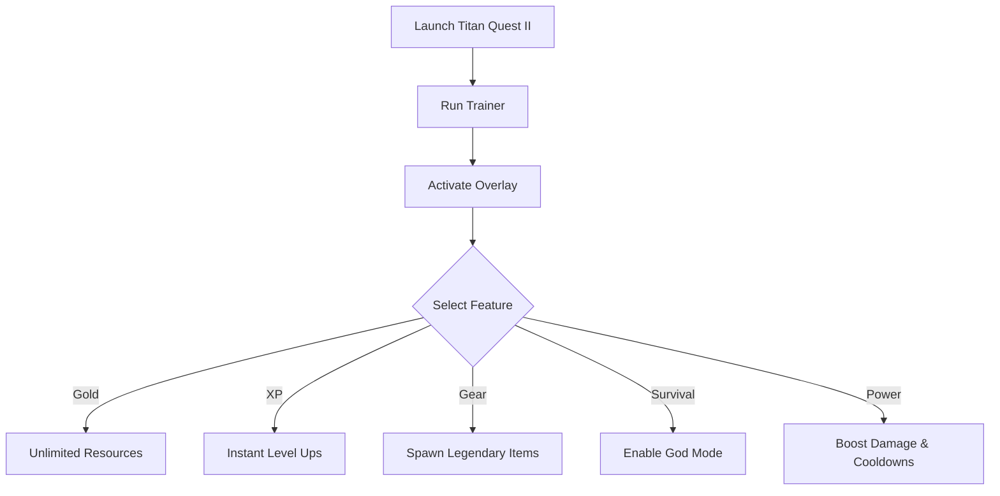

# ⚔️ Titan Quest II Trainer

Titan Quest II delivers epic battles against gods, monsters, and legends, blending fast-paced ARPG combat with deep loot and build customization. But farming endlessly for gold, items, and levels can slow down your mythic journey. The **Titan Quest II Trainer** gives you total control—letting you max out resources, boost damage, and skip grind instantly.

---

## 🔎 Overview

The trainer is built for players who want to:

* Add unlimited gold and resources
* Level up instantly with XP boosts
* Toggle god mode for stress-free battles
* Spawn rare gear and legendary loot
* Customize combat with damage multipliers and cooldown resets

It’s a **sandbox toolkit** for both casual fans and hardcore theorycrafters.

---

## ⚙️ Trainer Features

* **💰 Unlimited Gold** – Shop endlessly and craft without limits.
* **⚡ Instant XP Gain** – Unlock new skills and abilities immediately.
* **🛡 God Mode** – Stay invincible in any encounter.
* **🔮 Legendary Gear Spawner** – Generate weapons, armor, and mythic loot directly.
* **🔥 Damage Boost Multiplier** – Scale up attacks to one-hit enemies.
* **⏱ Cooldown Reset** – Spam ultimate skills endlessly.
* **🎛 Full Hotkey Control** – Customize every trainer toggle.

[!IMPORTANT]
The trainer is intended for **single-player only**. It does not affect online or co-op servers.

---

## 🖥 Compatibility

| Platform           | Support | Notes                      |
| ------------------ | ------- | -------------------------- |
| Windows 10/11      | ✅       | Fully supported            |
| Steam Edition      | ✅       | Recommended                |
| Other PC Launchers | ⚠️      | Requires manual path setup |
| Consoles (PS/Xbox) | ❌       | Not supported              |

---

## 📊 Trainer Workflow

## 🚀 Final Thoughts

The **Titan Quest II Trainer** gives you full freedom to build mythic heroes without grind. Whether you want to max out loot, unlock builds instantly, or just dominate monsters with godlike power—this trainer puts all control in your hands.

---
